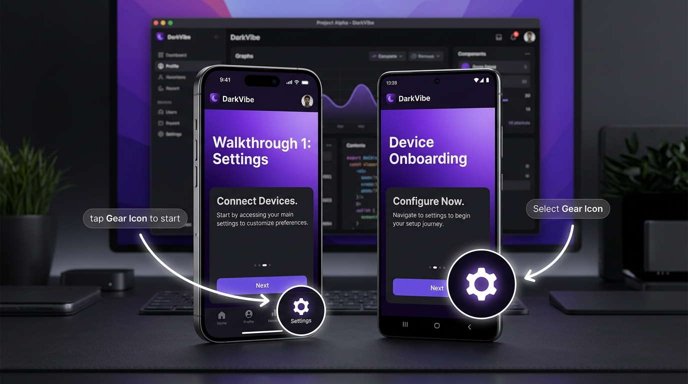

# Multispot



[日本語版のREADMEはこちら](README_JA.md)

**Multispot** is a lightweight, elegant, and highly flexible coachmark (onboarding walkthrough highlights) library designed for **Kotlin Multiplatform (KMP)** and **Compose Multiplatform**. 

With Multispot, you can easily guide users through your app's features using beautiful dimmed overlays, spotlight cutouts, and dynamic tooltips—even when targeted components are deeply nested within complex layouts, rows, cards, or scrollable lists.

---

## Features

- 🌍 **Kotlin Multiplatform**: Seamlessly supports **Android**, **iOS**, and **JVM Desktop** sharing the exact same UI rendering and coordination logic.
- 🎯 **Deep Layout Hierarchy Tracking**: Targets are automatically detected and coordinates calculated relative to the parent area scope using Compose's dynamic layout bounds tracking (`onGloballyPositioned`), ensuring highlights align correctly during window resize or layouts changes.
- 🔮 **Custom Spotlight Cutouts**: Supports customizable cutout geometric shapes:
  - `SpotShape.Circle(radius = null, margin = 4.dp)`: Allows custom explicit radius in `Dp` or automatically calculates from target bounds plus custom margins.
  - `SpotShape.Rect(margin = 4.dp)`: Rectangular cutout wrapping target layout with custom margins.
  - `SpotShape.RoundedRect(cornerRadius = 8.dp, margin = 4.dp)`: Rounded rectangular cutout with custom corner radius and margins.
- 🎨 **Tooltip Styles**: Choose the presentation style that fits your onboarding flow on a per-step basis:
  - `TooltipStyle.Balloon`: Solid premium dark background.
  - `TooltipStyle.Arrow`: Floating borderless text with customizable curves pointing to target.
  - `TooltipStyle.Glass`: Semi-transparent Glassmorphic card design.
  - `TooltipStyle.Outline`: Border-only bubble framing style.
  - `TooltipStyle.Custom`: Complete custom rendering control.
- 🛡️ **Overlap Prevention**: The tooltip placement algorithm measures available height and dynamically swaps the tooltip's placement (above/below/left/right) to prevent overlapping the highlight target.
- 💡 **Smart Gap Adjustment**: Automatically shrinks margins and spacing (`gap`) for `Balloon` style to fit tightly, and extends it for `Arrow` style to provide enough room to draw flowing paths.

---

## Installation

Add the library to your shared Kotlin Multiplatform module's `build.gradle.kts`:

```kotlin
kotlin {
    sourceSets {
        commonMain.dependencies {
            implementation("io.github.yutarosuzuki-jp:multispot:1.1.0") // Replace with actual library version
        }
    }
}
```

---

## Quick Start

### 1. Setup State and Area Container
Wrap your screen layout in a `MultispotArea` and remember a `MultispotState` to orchestrate walkthrough progression.

```kotlin
import io.github.yutarosuzuki_jp.multispot.*

@Composable
fun MyScreen() {
    val state = rememberMultispotState()

    MultispotArea(
        state = state,
        overlayColor = Color.Black.copy(alpha = 0.75f)
    ) {
        // Your main screen contents go here
        MainContent(state = state)
    }
}
```

### 2. Add Spotlights on Targets
Apply the `Modifier.multispot` to any target Composable. It will automatically register itself to the active step sequence.

```kotlin
@Composable
fun MainContent(state: MultispotState) {
    Column {
        Text(
            text = "Welcome to Multispot!",
            modifier = Modifier.multispot(
                state = state,
                step = 0,
                key = "welcome_title",
                shape = SpotShape.RoundedRect(8.dp),
                tooltipStyle = TooltipStyle.Balloon, // Card style tooltip fitting close to the header
                tooltip = {
                    TooltipBalloon(
                        title = "Welcome Tutorial",
                        message = "This header title is highlighted as step 0.",
                        style = TooltipStyle.Balloon
                    )
                }
            )
        )

        Spacer(modifier = Modifier.height(30.dp))

        // Deep nested elements are tracked correctly out-of-the-box!
        Box(
            modifier = Modifier
                .multispot(
                    state = state,
                    step = 1,
                    key = "action_btn",
                    shape = SpotShape.Circle(radius = 24.dp, margin = 8.dp),
                    tooltipStyle = TooltipStyle.Arrow, // Flowing arrow style pointing to the button
                    onTargetClicked = {
                        println("Target highlighted button clicked!")
                        state.next()
                    },
                    tooltip = {
                        TooltipBalloon(
                            title = "Settings Action",
                            message = "Tap this settings button highlight to trigger custom action and go next.",
                            style = TooltipStyle.Arrow
                        )
                    }
                )
        ) {
            Button(onClick = { state.start() }) {
                Text("Start Walkthrough")
            }
        }
    }
}
```

---

## License

This project is licensed under the MIT License - see the LICENSE file for details.
